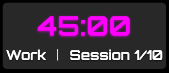
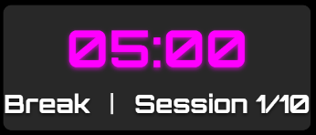
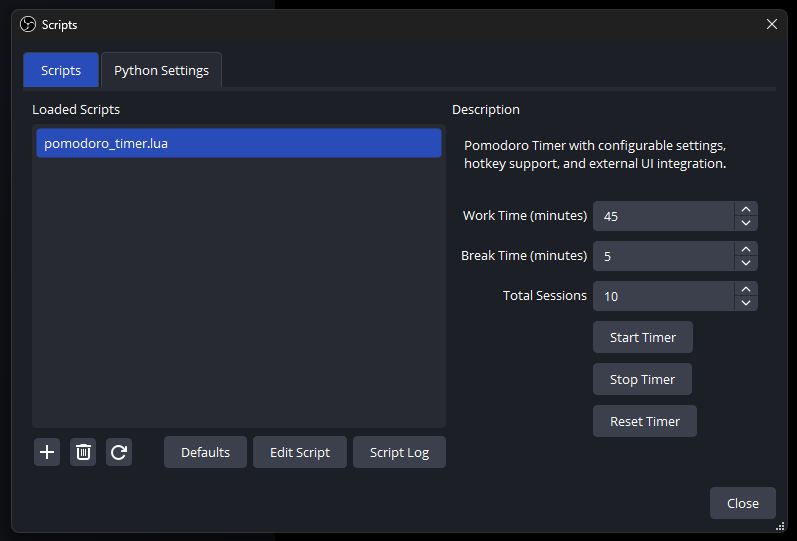
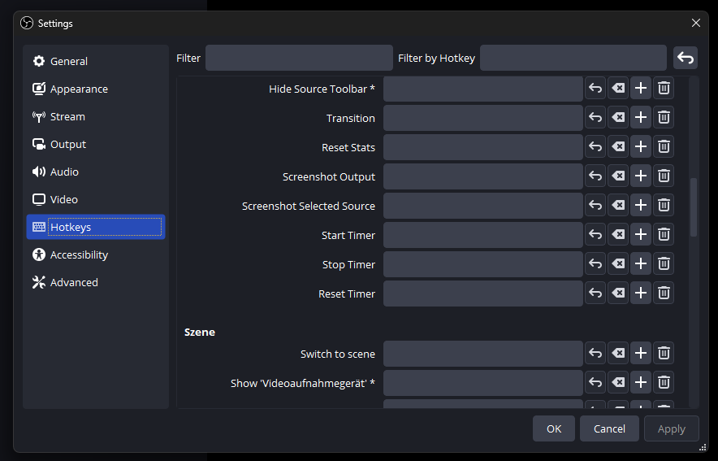

# Pomodoro Timer Overlay for OBS

This project provides a **Pomodoro Timer** overlay for OBS, allowing streamers to display their work and break sessions live on stream. The script is fully customizable with configurable work/break times and session counts. It integrates seamlessly into OBS with hotkey support and a sleek, modern design.

## Features
- **Configurable Work/Break Times**: Adjust the timer to suit your needs.
- **Session Tracking**: Display the current session and progress.
- **Hotkey Support**: Start, stop, or reset the timer directly via OBS hotkeys.
- **Overlay Integration**: A visually appealing and customizable timer for live streaming.
- **Transparent Background**: Blends perfectly with your stream layout.

## Installation and Usage

### 1. **Download Files**
   - Clone or download this repository as a ZIP file and extract it.
   - Ensure the following files are present:
     - `pomodoro_timer_updated.lua`
     - `timer_ui.html`

### 2. **Set Up in OBS**
   1. Open OBS and go to `Tools > Scripts`.
   2. Add the `pomodoro_timer_updated.lua` script.
   3. Configure your timer settings (work time, break time, total sessions).
   4. Define hotkeys for starting, stopping, and resetting the timer in `Settings > Hotkeys`.

### 3. **Add the Timer Overlay**
   1. Add a new `Browser Source` in OBS.
   2. Point the `Local File` option to `timer_ui.html`.
   3. Adjust the width and height to fit your stream layout.

### 4. **Start Streaming**
   - Use the configured hotkeys or the script GUI to control the timer.
   - The `timer_status.txt` file will be automatically created in the script's directory and updated in real time to reflect the timer's state.
   - The overlay fetches its data from this file to keep the display updated.

## Screenshots
### Timer Overlay:

### OBS Script Settings:

### OBS Hotkeys Configuration:

## Contribution
Feel free to submit issues or pull requests for bug fixes and new features. Feedback is always welcome!

## License
This project is licensed under the **MIT License**. See the [LICENSE](LICENSE) file for details.